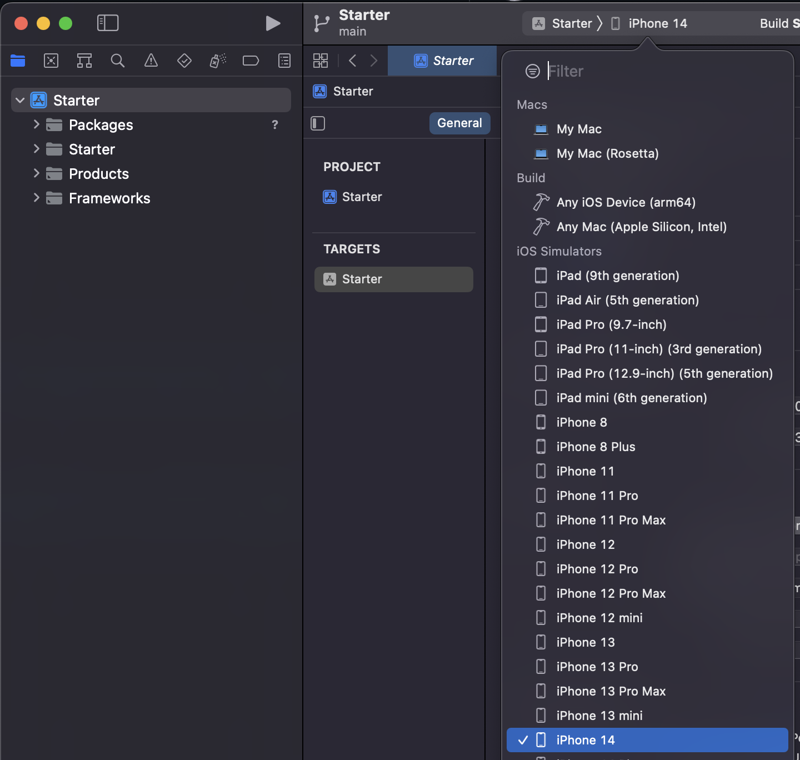
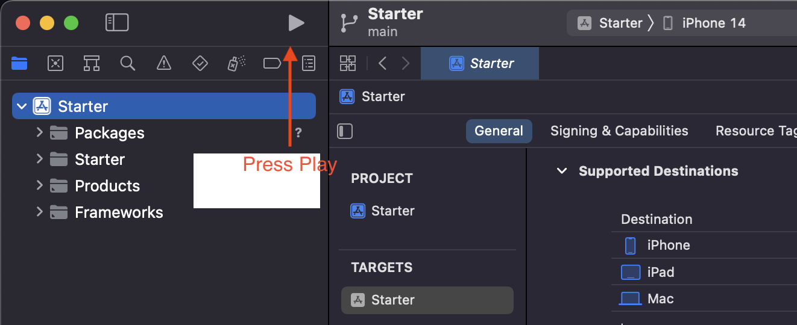

## Welcome to Expedia Groups Women of silicon valley roundabout workshop 2022

### Requirements
 - You’ll need a MacOS computer (macOS Monterey 12.5 or later)
 - Xcode 14
 - iOS simulator with iOS 16 

### Setup
1. Clone the project 
2. In Finder, open up the "WOSR-Workshop" folder
3. Go into the "Starter" folder
4. Open Starter.xcodeproj file
5. In Xcode, select the iPhone 14 simulator

6. Press Play to launch the app in the simulator

## Workshop 
This workshop will cover some of the key concepts that we use to develop in Expedia and our drive towards Mobile first development.

### Tech stack
At Expedia we have quite a large tech stack but today we will endeavour to cover some of the most important ones for native app development:
- Swift UI
- Combine
- Swift Package Manager
- Tokens approach 
- Server Driven UI

## Theory and the Why's 
We will also answer the questions:
- Why did we choose to change our UI to use SwiftUI before many other applications? 
- What were the challenges that we faced by committing to this change.
- How do we cutomize our code base to handle 23 brands without making a mess of the code and what were our challenges (one codebase 23 brands).
- The power of server driven UI in our apps.
